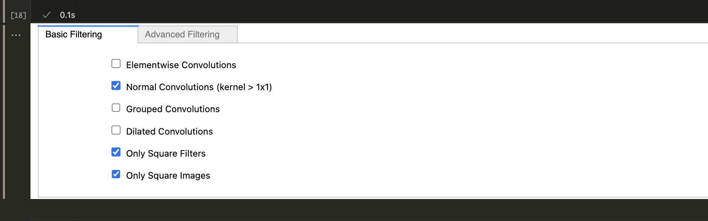

# ConvBench: A Comprehensive Convolution Performance Assessment Benchmark

ConvBench provides an end-to-end platform for convolution algorithm evaluation. Based on the literature about convolution algorithms, we defined a standardized nomenclature for all different processing steps a convolution algorithm might have, and, particularly, a default timing assessment API that ensures a fair environment to compare different approaches in more than 9 thousand different 2D convolution layers extracted from all TIMM's deep learning model collection.

> [!TIP] 
> **TL;DR** - Take a look at the [ConvBench.ipynb](ConvBench.ipynb) jupyter notebook. We provide a simple all-in-one interface that takes care of all filtering, compiling, and plotting particularities. Just change the convolution and convolution_baseline cells and see the magic!

## Detailed project description. 

### Convolution Operation Set.

This step comprises the Convolution set construction. For each of all available models from TIMM’s deep learning model collection, the biggest DL model collection available on the internet, we iterated along the layers and extracted information pieces about all encountered 2D convolution operations. In the end, 9011 different convolution operations were acquired, in which:
- 5481 of them are elementwise operations.
- Of the remainder 3530 convolutions:
    - 2269 convolutions are grouped convolutions;
	- 17 convolutions are dilated;
	- 93 convolutions have rectangular filters;
	- 2 convolutions expect rectangular inputs;
	- And, only 1156 are related to the common convolutions.

> [!TIP]
> For more information about all these different kind of convolutions, we recommend the following reference: [Convolution GIFs](https://github.com/vdumoulin/conv_arithmetic)

The hyper-parameters of the 1156 common convolutions have the following data distributions:


While, the number of Float Point Operations (FLOPS) for each of the common convolutions is distributed in the range of 0.0009 GFLOPS and 43.49 GFLOPS, ranging from small and fast operations to large and computationally expensive ones


|       |      |      | GFLOPS |        |        |        |       |
|-------|------|------|--------|--------|--------|--------|-------|
| Count | Mean | STD  | Min    | 25%    | 50%    | 75%    | Max   |
| 1156  | 0.83 | 2.55 | 0.0009 | 0.0578 | 0.1971 | 0.5609 | 43.49 |


### ConvBench Library

The ConvBench Benchmark was designed as an encapsulation class that must be included, inherited, and overridden. Its main methods are:

- `virtual void convolution(...)`: The main convolution algorithm to be assessed (it must be overridden).
- `virtual void convolution_baseline(...)`: The baseline algorithm to be compared (it must be overridden).
- `void convset_exec(data_strategy, running_strategy)`: The execution procedure. It expects a data_strategy enum type, which selects how the data buffers will be filled (random, constant, follow_dist, or load), and a running_strategy enum type that selects which conv algorithm will be called (direct, baseline, or correctness).

Things you must pay attention to when implementing your own convolution algorithm: 
- ConvBench is a Templated class by \<T\>, and thus the type of the data buffers (inputs, kernels, bias, outputs) can be changed by its children class.
- There are some typedefs that we encourage you to use them to standardize things, such as:
    - dimension type (dim_t, an unsigned int64); 
    - index type (index_t, a signed int64);
    - shape type (shape_t, a vector of dim_t objects).
- The random number generator follows a normal distribution.
- There are also LOG and DEBUG directives that can be activated/deactivated during compilation time (-DCERR_LOG=0/1 and -DCERR_DEBUG=0/1).
- And mainly, **Do not forget** to write a simple main function that instantiates the child class and call convset_exec method.

### Timing class


From what we have seen in the literature and DL frameworks, such as oneDNN, ONNX-MLIR, GLOW and PyTorch, a convolution operation can be broken into some different steps.

1. **Pre-Convolution Packing**: The data reordering preprocessing step to transform the input data in order to match the convolution expected data layout.
2. **Convolution operation**: You can think about this step as similar to when you effectively call the proper convolution function implementation. This step comprises possible data transformations (tiling, packing/unpacking), and microkernel function calling (BLAS, MKL).
    - **Tiling**: This step slices the convolution data into smaller chunks in order to make them fit in the system’s cache memory, for example.
    - **Packing**: Reorder the convolution data into some needed order, for example, linearizing input windows and kernel windows to simply matrix multiply them later.
    - **Microkernel**: The effective worker of the convolution algorithm, that is, the procedure that multiplies and accumulates in order to obtain an output element. They are usually related to BLAS, openBLAS, BLIS, or MKL GEMM methods.
    - **Unpacking**: Since the data were broken into parts (Tiling) and reorganized (Packed), in order to maintain the input data layout it should be needed to reorder the output elements to match the input data layout. 
3. **Post-Convolution Unpacking**: return the output data to the original layout in order to match the next step's expected layout.

There is also a **Total Conv** time that accounts for the entire 2nd step; and a **Total Operation** time that accounts for all steps.

All these names are well-known concepts in the literature, however, it is easy to get their usage mixed and messy when comparing the performance of different frameworks. For example, usually, it is not clear what kind of timing the total convolution time accounts for; d*oes it already sum up the pre-convolution packing and post-convolution unpacking time? what if the compared framework already gets the input and weight data reordered from compiling time and thus this pre/post conv packing is zero ?* it won’t be fair.

Because of all of this, we propose a timing class that ConvBench inherits and accounts for all these described timing concepts. Simply add `<time_name>_start()` and `<time_name>_update()` methods enclosed by a TIME directive in the right points of your convolution algorithm.

## ConvBench Usage

### Setting up the environment

For this, we make available a docker file with all environment-related topics set. 
1. Clone the repository. 
2. Build the docker image with the following command.
``` bash
podman build --build-arg USER_ID=$(id -u ${USER}) --build-arg GROUP_ID=$(id -g ${USER}) --build-arg VSCODE_COMMIT=<vscode commit hash you aim to use vscode> -t convbench:22.04 .
```
3. Run the docker image including the repository path as follows.
``` bash
podman run --name <container_name> --rm -it --userns=keep-id -v /path/to/the/repo/ConvBench:/home/user/ConvBench/ -w /home/user/ convbench:22.04
```
4. You are ready to go!

Otherwise, if you do not aim to use docker it is also possible to build the environment by yourself. In this case, this project has the following dependencies:
- Clang 14
- Python3.10
	- Pandas, 
    - matplotlib, 
    - ipywidgets, 
    - notebook, 
    - timm, 
    - torch, torchvision and torchaudio CPU version.
- pystring library (bin and include folder)
- System-wide available fmt
- System-wide available omp
- System-wide available openblas

> [!WARNING]
> You probably will encounter linker problems. Try using LD_LIBRARY_PATH environment variables to fix them.

### Using the Benchmark

To ease the ConvBench usage, we made available an [**all-in-one jupyter notebook interface**](ConvBench.ipynb) that groups all ConvBench functionality with a configuration interface. Simply implement the desired convolution algorithm in the respective code cells, select the filtering and hyper-parameter options, and, finally, hit the execute button to run the experiments and automatically plot some insightful graphs.

Here are some notebook preview:
- Basic and Advanced filtering interface formulary:




- Experimental Procedure Hyperparameter setting:


- Automatic Plotting Algorithms

